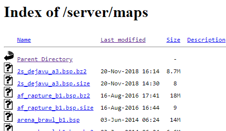
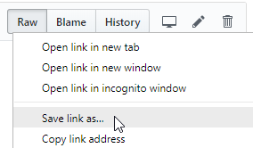

# Install-TF2Maps

This PowerShell script will download a set of Team Fortress 2 map files from a public download server and install them into your maps download folder.  This is useful for playing on a server with a lot of custom content so you can avoid waits to download custom maps on each map switch.

In addition to directly downloading any .bsp files, it will decompress any .bsp.bz2 files.

This script will also attempt to locate your Team Fortress 2 installation automatically.

## Prerequisites

Steam and Team Fortress 2 must be installed for the script to auto-detect the correct map installation location.

This script can download from any public download server which has an Apache index style page which lists the files.  Such a page will look like this:



This script has only been tested on Windows 10 so far.


## Install maps via simple method

You can install without doing any downloads and messing around in the powershell command line window.

* Type <kbd>Win</kbd>+<kbd>R</kbd>

* Copy/Paste the following single line into the run dialog text box:
```
powershell -command "iex (iwr https://raw.githubusercontent.com/DannyMeister/Install-TF2Maps/master/Install-TF2Maps.ps1)"
```
* Hit OK or <kbd>enter</kbd>

* You will be prompted to input the url which you can copy/paste from the address bar of your browser if you have found a fast download server. Or ask a server administrator of the gaming community you are playing with.

* The Steam and Team Fortress 2 directories will hopefully be auto-located, but if not you will be prompted for where to download the map files. An example of where Team Fortress map download folder if you installed Steam to `C:\Program Files\` would be `C:\Program Files\Steam\SteamApps\common\Team Fortress 2\tf\download\maps`

* The program will prompt you to type <kbd>Enter</kbd> to continue


## Install maps by downloading script

While slightly more involved, if you want to rerun frequently, or wish to make use of advanced parameters, you can first download the PowerShell script and invoke it from a PowerShell command line.

Click the name of the [Install-TF2Maps.ps1](Install-TF2Maps.ps1) file to navigate to it in GitHub.

Right-click the Raw button and choose to download the link to a directory of your choice on your computer.



## Installing Maps

Open the PowerShell console included in Windows. From the start menu, type `powershell` and click the "Windows PowerShell" desktop app link that Windows finds.

Change directory to the folder where you downloaded the file.  For example, if you downloaded to C:\Users\Bob\Downloads then type the following line.

```powershell
cd 'C:\Users\Bob\Downloads'
```

Enable the running of a script file downloaded from the internet by copy/pasting the command below. (Don't worry the `-Scope Process` means it is just a temporary setting for running this file and does not permanently lower your system's security! )

```powershell
Set-ExecutionPolicy Bypass -Scope Process -Force
```

Finally, copy/paste the following line.

```powershell
.\Install-TF2Maps.ps1
```

There are two optional parameters, `Url` and `Path`, one or both of which you can pass when calling the script if you already have the address of the download site and your TF2 2 maps directory handy. For example:

```powershell
.\Install-TF2Maps.ps1 -Url 'http://mygamehost.com/server/maps/' -Path 'D:\Program Files\Steam\SteamApps\common\Team Fortress 2\tf\download\maps'
```

## For server operators

Please do offer your players a file download redirect server!  The compressed files speeds their map switching and it of course allows you an easy way to offer pre-download via this script.  Official documentation at https://developer.valvesoftware.com/wiki/Sv_downloadurl is a little lean, but searching for tutorials on "FastDL for TF2" should turn up some tutorials.

It would be helpful to offer your players supplemental instructions with your map download URL already supplied via the `-URL` parameter.

You are welcome to download and offer this script in your own private website, forums, or wherever your community gathers, though you may consider linking to the latest in GitHub to ensure they always get the latest version, bug fixes, and instructions.

## Built With

* [PowerShell](https://github.com/PowerShell/PowerShell) - The scripting language used
* [SharpZipLib](https://github.com/icsharpcode/SharpZipLib/) - Library for extracting bz2

## Authors

* [DannyMeister](https://github.com/DannyMeister)

## Contributing
* Submit issues
* Submit pull requests
* Motivate me :)

[](https://www.paypal.com/cgi-bin/webscr?cmd=_donations&business=GPYH4ENJZLMV8&item_name=Motivation+to+work+on+Install-TF2Maps&currency_code=USD&source=url)

## License

This project is licensed under the MIT License - see the [LICENSE](LICENSE) file for details